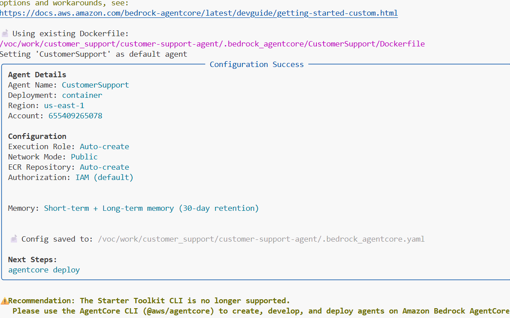
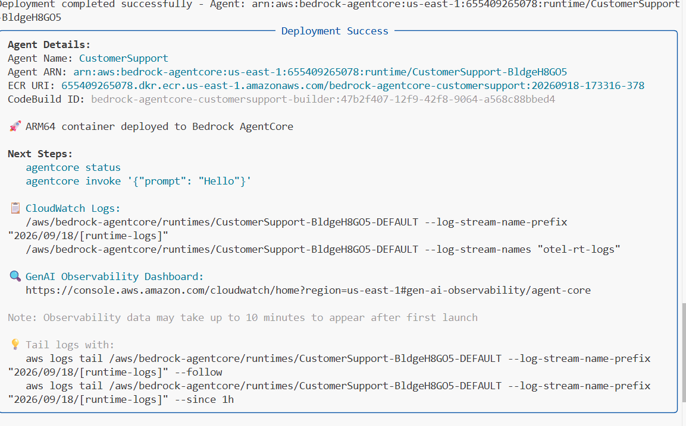
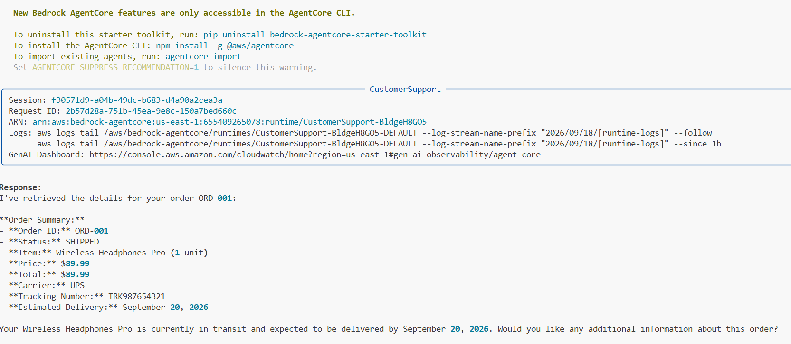
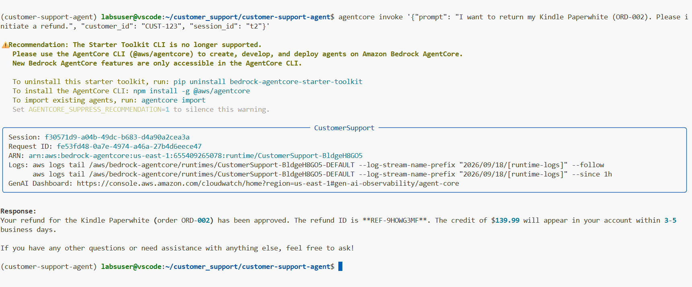
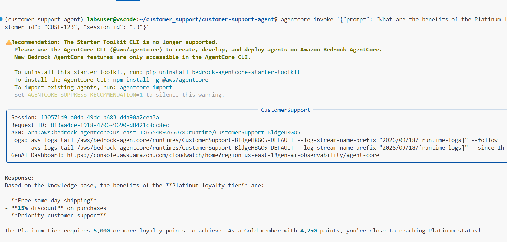
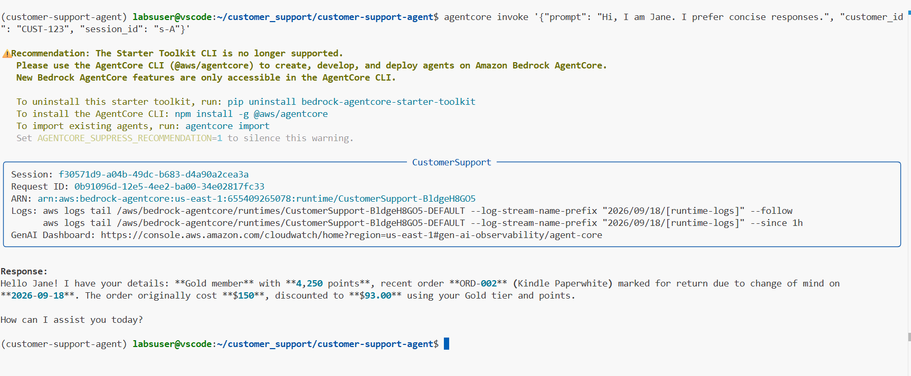
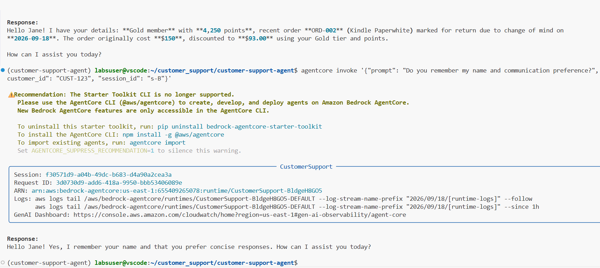
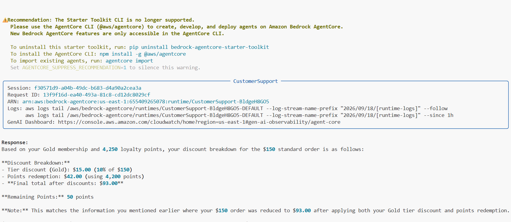
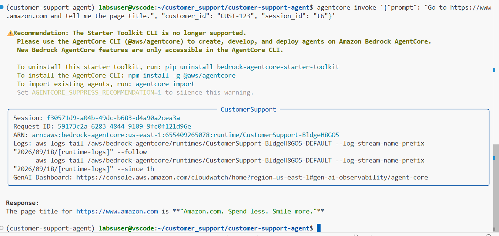
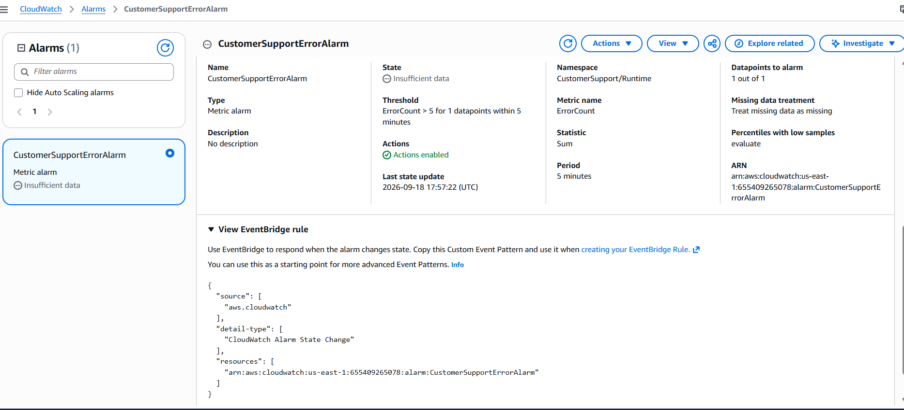

# AgentCore CodeBuild PROVISIONING → STOPPED

when exexut agentcore deploy , deployment field in phase
CodeBuild
  SUBMITTED    → SUCCEEDED
  QUEUED       → SUCCEEDED
  PROVISIONING → STOPPED
  BUILD        → never reached

  no build log from cloud watch 
  so analyse issue with gpt AI  and test diferent configuration
  discover the issue was BUILD_GENERAL1_MEDIUM not allowd
  suliotion is  edit file in AgentCore Starter Toolkit backages to BUILD_GENERAL1_SMALL
  .venv/lib/python3.13/site-packages/bedrock_agentcore_starter_toolkit/services/codebuild.py

 ## agentcor configuration 
  

  
## agentcor deployment

  


# Part 3 — Functional Testing

Run the following test scenarios and verify the expected behaviour. Include screenshots or copy the terminal output in your submission.

### Test 1 — Order Tracking

```bash
agentcore invoke '{"prompt": "Can you track order ORD-001?", "customer_id": "CUST-123", "session_id": "t1"}'
# Expected: shipping status, tracking number TRK987654321, carrier UPS, estimated delivery
```


### Test 2 — Refund Processing

```bash
agentcore invoke '{"prompt": "I want to return my Kindle Paperwhite (ORD-002). Please initiate a refund.", "customer_id": "CUST-123", "session_id": "t2"}'
# Expected: refund ID, APPROVED status, 3-5 business days message
```


### Test 3 — Knowledge Base (RAG)

```bash
agentcore invoke '{"prompt": "What are the benefits of the Platinum loyalty tier?", "customer_id": "CUST-123", "session_id": "t3"}'
# Expected: free same-day shipping, 15% discount, priority support
```

### Test 4 — Memory (Long-Term)

```bash
# Session A — introduce yourself
agentcore invoke '{"prompt": "Hi, I am Jane. I prefer concise responses.", "customer_id": "CUST-123", "session_id": "s-A"}'

# Session B (new session) — verify recall
agentcore invoke '{"prompt": "Do you remember my name and communication preference?", "customer_id": "CUST-123", "session_id": "s-B"}'
# Expected: agent recalls "Jane" and "concise responses"
```



### Test 5 — Loyalty Discount Calculation

```bash
agentcore invoke '{"prompt": "I am a Gold member with 4250 points. Calculate my discount on a $150 standard order.", "customer_id": "CUST-123", "session_id": "t5"}'
# Expected: points redeemed, tier discount 10%, final total, remaining points
```


### Test 6 — Browser Tool

```bash
agentcore invoke '{"prompt": "Go to https://www.amazon.com and tell me the page title.", "customer_id": "CUST-123", "session_id": "t6"}'
# Expected: page title retrieved from live Amazon.com
```


## Part 4 — CloudWatch Monitoring

screenshot of the alarm configuration



## reflection

## Brief Written Reflection

One important implementation decision was to use **Amazon Bedrock AgentCore Gateway with 
Lambda** for order and refund operations. This integration allows the Strands-based agent 
to access external business functions as tools instead of implementing transactional logic 
directly inside the agent. I chose this approach because it separates the agent's reasoning 
from backend operations and makes functions such as retrieving orders and initiating refunds 
independently accessible through the Gateway. I also used **AgentCore Memory** with a stable 
customer ID so the agent could remember relevant customer information across separate sessions.

A concrete challenge I encountered was during deployment, when the **CodeBuild process failed 
during the provisioning phase**. I investigated the deployment configuration, CodeBuild resources, 
IAM roles, and the build environment to identify the cause. I also encountered a limitation when 
creating the **Knowledge Base** because the lab environment did not provide the permissions 
required to create Amazon OpenSearch Serverless resources, and these IAM permissions could not 
be modified. Instead of being blocked by the lab restriction, I changed the Knowledge Base to 
use the **AWS-managed vector store**. This allowed me to continue implementing and testing the 
RAG functionality successfully.

For a production environment, I would add **Amazon Cognito** to authenticate customers and 
control access to customer-specific information. For example, the authenticated customer 
identity could be mapped to the AgentCore Memory actor ID so one customer could not access 
another customer's order history or stored preferences. I would also use **Amazon Bedrock 
Guardrails** to help control unsafe inputs and outputs. Additional production considerations 
would include monitoring and alerting, fine-grained IAM permissions, cost controls, automated 
evaluation, and human approval for sensitive operations such as refunds.
